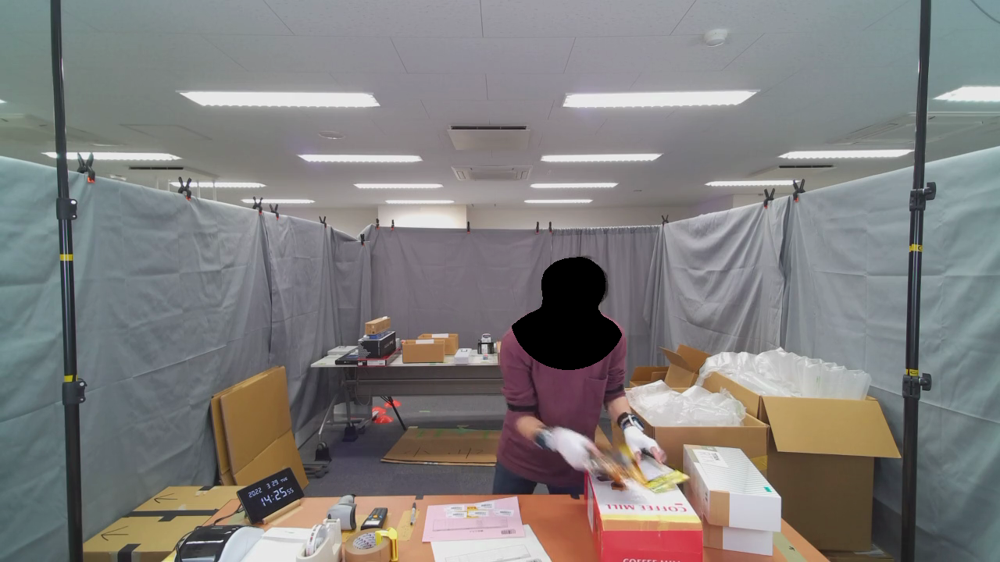

# Video Annonymization

This is a script to create the anonymided video like this ([OpenPack - RGB with Annotation - U0209-S0100 - Youtube](https://youtu.be/RiZ7kVpIHwU?si=WoalL-Bx3caLlJki)).

For the privacy and ethical reason, when we release RGB images, mask have to be applied for anonymization.
We combined a sematic segmentation model and a pose estimation models to generate high-confident mask for subhect's head area.

## How to use?

- Setup docker container

```bash
docker compose build
docker compose up -d
docker compose exec openpack-vision bash
```

- Run `annonymization.py`

```bash
python annonymization.py -i ../samples/openpack-sample-raw.mp4
```

## Annonymization Approach

This method combines a semantic segmentation model and a pose estimation models.
The semantic segmentation models can generate accurate mask for human and it is more robust to detect humans.
However, the whole body will be masked.
On the ohter hand, a pose estimation model gives a location of body parts but it often fails to detect face keypoints due to occlusions.
Therefore we combined outputs from these two models to generate a mask with high reliability like bellow.
If the pose estimation model cannot detect anything, apply the whole human segmentation mask.



Note: We tried face detection models but they were not robust for the side angle and frequently fails to annoymize people's head.

### Models

- Keypoint Estimation
  - [Keypoint R-CNN](https://pytorch.org/vision/stable/models/keypoint_rcnn.html)
- Semantic Segmentation
  - [DeepLabV3](https://pytorch.org/vision/stable/models/deeplabv3.html)

## Reference

- https://tech.fusic.co.jp/posts/2019-07-18-torchvision-keypoint-r-cnn/
- https://pytorch.org/vision/stable/auto_examples/others/plot_visualization_utils.html#visualizing-keypoints
